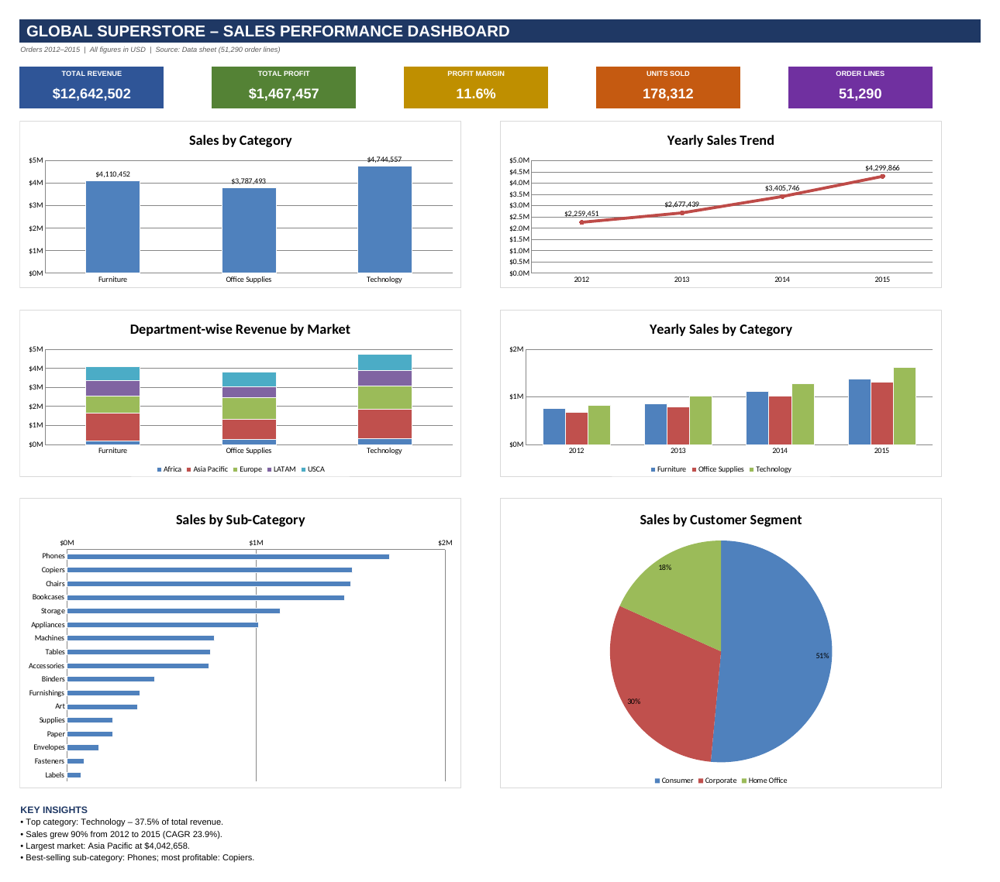

# Sales Performance Dashboard – Global Superstore

An Excel dashboard that analyzes sales performance using the Global Superstore dataset (51,290 order lines, 2012–2015).

(pivot_analysis.png)

## Objective
Analyze total revenue, sales by category, yearly sales trends and department-wise revenue.

## Files
- `Sales_Performance_Dashboard.xlsx` – the workbook
  - **Dashboard** – KPI cards, 6 charts and key insights
  - **Pivot Analysis** – summary (pivot-style) tables
  - **Data** – the Orders data from `global_superstore_2016.xlsx`
  - **Notes** – assumptions and how to build native PivotTables

## Analysis Covered
- **Total Revenue** – overall sales, profit, margin and units sold
- **Sales by Category** – Furniture, Office Supplies, Technology, plus sub-categories
- **Yearly Sales Trends** – sales by year with year-over-year growth
- **Department-wise Revenue** – revenue by department (Product Category) and Market

## Key Findings
- Total revenue is **$12.64M** with **$1.47M** profit (11.6% margin).
- **Technology** is the top category with 37.5% of sales.
- Sales grew **90%** from 2012 to 2015 (about 24% a year).
- **Asia Pacific** is the largest market ($4.04M).
- **Phones** sell the most, **Copiers** are the most profitable, and **Tables** lose money.

## Assumptions
- The dataset has no "Department" column, so Product Category is used as the department.
- Revenue is the `Sales` column, and years come from Order Date.
- The summary tables use `SUMIFS` formulas, so they update if the data changes.

## Tools
Microsoft Excel

## Data Source
[Global Superstore 2016](https://github.com/hshariq/Global-Superstore-2016-Power-BI)
